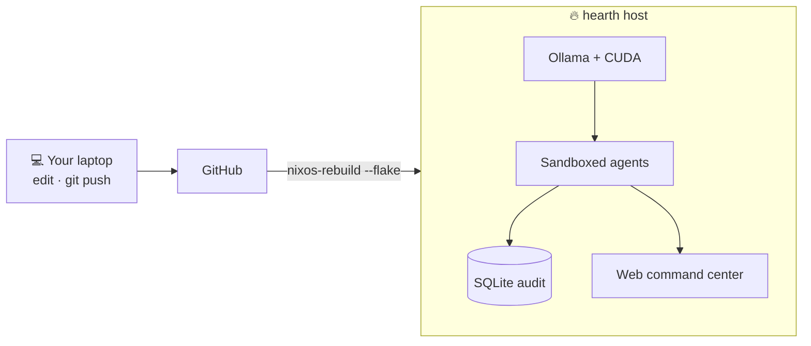
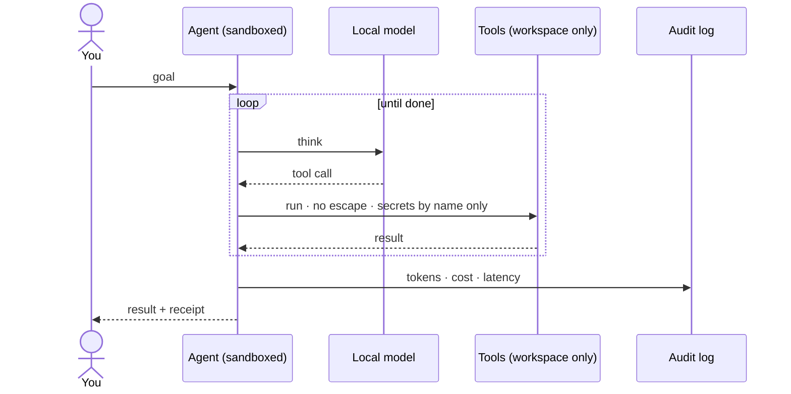

<div align="center">


<br/>
<br/>

[](https://github.com/EricFinland/hearth/actions/workflows/build.yml)


[](https://github.com/EricFinland/hearth/releases)

### Local LLMs and autonomous coding agents on your own hardware, at zero cost.

[**📖 Documentation**](https://ericfinland.github.io/hearth/) &nbsp;·&nbsp; [**🪟 Hearth for Windows**](docs/windows.md) &nbsp;·&nbsp; [**🐧 NixOS quickstart**](#the-nixos-system) &nbsp;·&nbsp; [**🧠 Architecture**](https://ericfinland.github.io/hearth/concepts/architecture/)

</div>

---

Hearth runs local models on your own machine and gives them tools: files, a
shell, an agent loop that can be turned loose on a task. It comes in two
forms today.

**Hearth is a Windows desktop application in development. There is no
download yet.** The engine underneath it (permissions, containment,
checkpoint/undo, the sidecar HTTP layer) is built and self-tested; the
desktop shell, the UI, and the installer are not built. Once it exists, the
pitch is simple: point it at a model through [Ollama](https://ollama.com)
and it works the way a hosted AI assistant does, except every token comes
from your own GPU at no cost, and it tells you honestly what your hardware
can actually run instead of leaving you to guess. **Hearth Code** is the
agentic coding surface inside Hearth: the part that reads your repo,
proposes edits, runs commands, and can be handed a task to work on while
you do something else. Two names, used consistently throughout this repo:
Hearth is the application, Hearth Code is the coding agent inside it.

**Hearth is also a fully declarative NixOS system.** The same agent engine
runs as sandboxed systemd units on a machine defined entirely by one
`flake.nix`, with every run audited to a local database and the whole OS
reproducible and reversible with a single command.

Windows is the newer, larger surface, and the one most people will meet
first. NixOS users, skip ahead to [the NixOS system](#the-nixos-system).

> **NixOS system: v1.6, stable.** The whole stack runs on real hardware:
> sandboxed agents, the audit log, the reproducible flake, the web cockpit,
> an OpenAI-compatible API, a local knowledge base, a standing-missions
> scheduler, a declarative model router, a natural-language audit query, and
> a self-improvement loop that only ever produces reviewable, gated
> branches, never auto-changing a running system. Local model quality is the
> honest ceiling. See the [CHANGELOG](CHANGELOG.md).

> **Windows desktop app: in development, nothing published yet.** The agent
> engine underneath Hearth Code, hardware detection, the model shop's fit
> calculator, workspace containment, and git-backed checkpoint/undo, is
> built and self-tested on Windows. The desktop shell, the UI, the
> installer, and the model shop's actual interface are not built yet. There
> is no download. [Hearth for Windows](docs/windows.md) says exactly what
> exists today; [the Windows threat model](docs/security/windows-threat-model.md)
> says exactly what does not.

## Hearth for Windows

Read the full page: **[docs/windows.md](docs/windows.md)**. It covers what
Hearth and Hearth Code are, what you need today (Ollama, installed and with
a model already pulled), how a model and a context length get chosen for
your specific GPU, what the permission modes (`plan`, `edit`, `auto`,
`bypass`) mean, and how undo works.

Also worth reading before you trust it with anything real:

- **[docs/model-shop.md](docs/model-shop.md)**: how the model shop's fit
  verdicts work, why they're based on KV-cache math rather than parameter
  count, and why it deliberately does not predict tokens per second.
- **[docs/limitations.md](docs/limitations.md)**: the honest one. Local
  models are weak compared to hosted ones, `run_command` is not contained,
  and approving a command by reading its text is not a security control.
  Read this before running Hearth Code against anything you care about.
- **[docs/security/windows-threat-model.md](docs/security/windows-threat-model.md)**:
  the full threat model this was distilled from.

## The NixOS system

Most people run local agents with full system privileges and no record of
what they did. **hearth flips that.** Agents are contained at the
operating-system level, every run records its tokens, cost, latency, and
errors to a local database, and the entire system is defined in one
`flake.nix` you can rebuild identically and roll back in a single command.

> It is not a custom kernel or a remastered distro. It is a declarative
> NixOS system you `nixos-rebuild switch` into existence.

### What makes it different

|  |  |
| --- | --- |
| 🛡️ **Sandboxed by default** | Agents run as ephemeral, isolated systemd units. No host secrets, no writes outside their own workspace, no privilege escalation. |
| 🧾 **Every run audited** | Tokens, cost, latency, and errors land in local SQLite. One command shows the last 20 runs. A failed run still leaves a trail. |
| ♻️ **Reproducible from boot** | One flake builds the whole OS. Atomic, bootloader-level rollback. Two builds from the same lock are identical. |
| 🧠 **Local and private** | Ollama on your own GPU, agents that actually use tools, a web command center. Zero cloud, nothing leaves the box. |

### Architecture



### See it run

```console
$ hearth-status
● ollama       active (running)   llama3.2:3b, mistral:7b
● tailscale    connected
● recent runs  3 in the last hour

$ hearth-runs
AGENT   MODEL          TOKENS   LATENCY   COST
demo    llama3.2:3b      142     0.9s     $0.00
build   qwen2.5-coder    2.1k    14s      $0.00
chat    mistral:7b       430     3.2s     $0.00
```

### How a run stays contained



### NixOS quickstart

```sh
git clone https://github.com/EricFinland/hearth
cd hearth

nix flake check               # validate the whole system
bash scripts/build-image.sh   # build a bootable image
```

Full install paths (existing NixOS host, fresh VM, or a Linux primer) live in the docs:

#### → **[ericfinland.github.io/hearth](https://ericfinland.github.io/hearth/)**

#### Use it

```sh
# Point any OpenAI client at your local models (audited):
curl http://your-hearth:8770/v1/chat/completions \
  -d '{"model":"llama3.2:3b","messages":[{"role":"user","content":"hello"}],"stream":true}'

# Check the install is healthy:
hearth-doctor

# Watch activity in Grafana, etc:
curl http://your-hearth:8770/metrics
```

<details>
<summary><b>The full NixOS feature set</b></summary>

<br/>

- **Declarative NixOS system.** The entire OS is one flake; `nixos-rebuild switch` applies changes atomically.
- **Ollama on boot** with a declarative model manifest pulled on activation, CUDA-accelerated.
- **Tool-using agent loop** (`hearth-loop`): a model gets a goal and tools (run commands, read and write files, HTTP), runs in a per-run workspace, and is audited.
- **Least-privilege sandbox** with a written threat model: `ProtectSystem=strict`, `ProtectHome`, `NoNewPrivileges`, empty capabilities, a syscall filter, and per-run private temp.
- **Per-run audit log** in SQLite, queryable with `hearth-runs`.
- **Web command center:** chat with a local model and launch sandboxed agents from the browser, with permission modes, an approvals queue, and a kill switch.
- **OpenAI-compatible API** (`/v1/chat/completions` with real token streaming, `/v1/models`): any OpenAI client uses your local models, every call audited.
- **Knowledge base (RAG):** ingest docs or a whole repo (`index_dir`), semantic retrieval via local embeddings with lexical fallback, auto-recalled into agent context.
- **Standing missions:** a scheduler that runs missions on a cadence (the works-while-you-sleep layer).
- **Self-improvement loop:** an always-on daemon proposes changes to hearth's own config, validates them with `nix flake check`, compounds and learns, and produces reviewable branches with one-click promote-to-live and an auto-rollback watchdog.
- **OS-level egress enforcement:** when a run declares its allowed hosts, hearth programs per-run nftables walls that drop everything else at the kernel, so a run cannot slip the tool-layer allowlist by shelling out to `curl`.
- **Flight recorder and replay viewer:** every run records a structured per-step event stream; a scrubber replays it step by step, with each tool call's args, output, duration, and permission verdict inspectable.
- **Run diff:** `POST /diff` runs the same prompt against two local models and returns tokens, latency, and output side by side, so "which model for this?" is a live test, not a guess.
- **Spend circuit breaker:** a hard daily token budget across all runs; at the cap, running agents halt gracefully and new runs refuse to start until local midnight.
- **Unified alerting:** one fan-out pushes every alert to Telegram and ntfy, firing on errors, tripwire trips, and budget breaches so the box can reach your phone.
- **Declarative missions:** scheduled cron-as-flake missions you define in the flake, rendered read-only and merged with cockpit-created ones, each launch carrying its capability manifest and egress allowlist.
- **Declarative model router:** `hearth.router` in the flake picks the right model per launch from keyword and tool-based rules, with the decision recorded in the flight recorder.
- **Natural-language audit query:** ask the audit database a question in plain English; a local model translates it to a validated, read-only `SELECT` and summarizes the result.
- **Observability:** a Prometheus `/metrics` endpoint, a usage-over-time stats view, and `hearth-doctor` for a one-command health check.
- **Agent credentials by name:** keys are substituted at request time via systemd credentials, so the model never sees the secret value.
- **More agent tools:** grep, multi-file edit, directory tree, web-to-knowledge, and more.
- **Optional KDE Plasma desktop**, a Tailscale mesh with a tight firewall, secrets via sops-nix, and a boot dashboard.

</details>

---

## Contributing & security

Contributions are welcome, see [CONTRIBUTING.md](CONTRIBUTING.md) for the build
and self-test workflow. Found a security issue? Please follow
[SECURITY.md](SECURITY.md) rather than opening a public issue. The Windows
build has its own threat model at
[docs/security/windows-threat-model.md](docs/security/windows-threat-model.md),
since the containment story there is different from the NixOS system's.

> **First-boot note (NixOS):** the config ships a default console password for the very
> first local login (SSH is key-only). Change it immediately with `passwd`. See
> [SECURITY.md](SECURITY.md).

---

<div align="center">

Built by <a href="https://github.com/EricFinland">Eric Catalano</a> &nbsp;·&nbsp; MIT licensed &nbsp;·&nbsp; <a href="https://ericfinland.github.io/hearth/">Docs</a> &nbsp;·&nbsp; <a href="CONTRIBUTING.md">Contribute</a> &nbsp;·&nbsp; <a href="SECURITY.md">Security</a>

</div>
