<div align="center">



<br/>
<br/>

[](https://github.com/EricFinland/hearth-windows/actions/workflows/build.yml)


### Local LLMs and an autonomous coding agent on your own Windows machine, at zero cost.

[**Get started**](docs/getting-started.md) &nbsp;·&nbsp; [**Hearth for Windows**](docs/windows.md) &nbsp;·&nbsp; [**The model shop**](docs/model-shop.md) &nbsp;·&nbsp; [**Packaging**](docs/packaging-windows.md) &nbsp;·&nbsp; [**Threat model**](docs/security/windows-threat-model.md) &nbsp;·&nbsp; [**Limitations**](docs/limitations.md)

</div>

---

Hearth runs local models on your own machine and gives them tools: files, a
shell, an agent loop that can be turned loose on a task.

**Hearth is a Windows desktop application in development. There is no
download yet.** The engine underneath it (permissions, containment,
checkpoint/undo, model downloads, the sidecar HTTP layer), the desktop
shell, the interface and the installer are all built; the installer is
unsigned, so it is not something to hand to a stranger yet. Hearth brings
its own inference engine and its own Python, so nothing else has to be
installed first. The pitch is simple: it works the way a hosted AI assistant
does, except every token comes from your own GPU at no cost, it tells you
honestly what your hardware can actually run instead of leaving you to
guess, it downloads that model with a progress bar that does not lie, it
flags content that looks like it is trying to steer the model before you
approve acting on it, and it stays out of your way while you are using the
machine for something else. **Hearth Code** is the agentic coding surface
inside Hearth: the part that reads your repo, proposes edits, runs
commands, and can be handed a task to work on while you do something else.
Two names, used consistently throughout this repo: Hearth is the
application, Hearth Code is the coding agent inside it.

> **Status: in development, nothing published.** The agent engine, hardware
> detection, the model shop's fit calculator, workspace containment, git-backed
> checkpoint and undo, model downloads with honest progress, a prompt-injection
> scanner, an outbound secret scanner, task-aware model routing, idle-aware
> compute, and first-run setup diagnosis are all built and self-tested on
> Windows. So are the desktop shell, the interface, and a Windows installer
> that carries its own inference engine and its own Python: `python
> scripts/build_windows.py` produces it, and
> [docs/packaging-windows.md](docs/packaging-windows.md) documents it. The
> installer ships llama.cpp's CPU build, which is the only one that cannot
> fail to start on an unknown machine, and Hearth fetches the right GPU build
> for the card it finds on first launch, verifies that it actually runs there,
> and falls back to the CPU build if it does not. On an RTX 5080 that is 13.8
> tokens per second before and 169 after. That installer is **unsigned**,
> which means the first person to run it meets a full-screen SmartScreen
> warning whose only visible button is "Don't run". Until there is a
> code-signing certificate there is no download and nothing to hand to a
> stranger. [Hearth for Windows](docs/windows.md) says exactly what exists
> today; [the Windows threat
> model](docs/security/windows-threat-model.md) says exactly what does not.

## Hearth for Windows

**New here? [docs/getting-started.md](docs/getting-started.md)** goes from an
empty folder to a running Hearth in order, and is the page to read first.
Nothing has been released yet, so building it yourself is the only way to run
it today, and that page walks through it.

Then read the full reference: **[docs/windows.md](docs/windows.md)**. It
covers what Hearth and Hearth Code are, what you need today (Windows, and
that is close to all: the install carries its own interpreter and its own
inference engine, and Ollama is optional rather than required), how a model
and a context length get chosen for
your specific GPU, how a model download reports honest progress, what the
permission modes (`plan`, `edit`, `auto`, `bypass`) mean, how Hearth flags
content that looks like it is trying to steer the model or a write that
looks like it is leaking a credential, how `.hearthignore` narrows which
paths the file tools will touch (and why that is not a secrecy boundary),
and how undo works.

Also worth reading before you trust it with anything real:

- **[docs/model-shop.md](docs/model-shop.md)**: how the model shop's fit
  verdicts work, why they're based on KV-cache math rather than parameter
  count, and why it deliberately does not predict tokens per second.
- **[docs/limitations.md](docs/limitations.md)**: the honest one. Local
  models are weak compared to hosted ones, the `run_command` sandbox stops
  writes outside your workspace but never reads or network traffic, and
  approving a command by reading its text is not a security control. Read
  this before running Hearth Code against anything you care about.
- **[docs/security/windows-threat-model.md](docs/security/windows-threat-model.md)**:
  the full threat model this was distilled from.

### The work loop

`agent/hearth_workloop.py` takes one goal and works at it across many turns,
unattended, until it finishes or can tell you exactly why it stopped.

```
python agent/hearth_workloop.py "fix the failing tests in stats.py" \
  --workspace ./project --done-command "python -m pytest -q" \
  --max-turns 40 --max-seconds 7200
```

It stops for exactly one of six reasons, and says which: it finished (proved
by `--done-command` exiting 0, or by the files named with `--artifact`
actually existing), it hit a ceiling (turns, wall clock, tokens, unattended
writes, tool calls), it stopped making progress, you stopped it, it needed a
permission nobody was there to give, or it errored.

The interesting one is **stopped making progress**. Four detectors run over
the whole run rather than a recent window: the workspace not reaching any
state it has not already been in, thrashing back and forth between states it
has seen, repeating an identical tool call, and hitting the same error over
and over. The account names which one fired, quotes the error, and shows the
turn-by-turn history:

```
stopped making progress: the same error recurred in the last 5 turns
  [repeat_error] ... FAILED test_type: f(1) must be both an int and a str
  what the completion check said:
    FAILED test_sign: f(1) must be both positive and negative, got -1
    3 failed
```

What it cannot see is documented on `ProgressLedger` itself and repeated in
every report: it measures **change, not correctness**. Work that happens
outside the workspace is invisible to it, and steady progress toward a wrong
answer never trips a single detector.

### How long it keeps trying is your call

"Stopped making progress" is a judgement made at a threshold, and the first
thresholds this loop shipped with were wrong. A benchmark caught them: 8 of 8
unattended runs stopped `stalled` at a mean of **5.5 turns out of 18 allowed**,
and the same loop with detection switched off solved a task the defaults never
solved. The cause was specific. A failing completion check contributes its own
output to every turn's errors, so `repeat_errors=5` was not "the model is
repeating itself", it was a hard cap of five turns on any run whose tests do
not go green almost immediately.

So the defaults were re-measured, and the decision is now one named setting
rather than five numbers:

| setting | it stops when | on an 18-turn budget, a hopeless run costs |
| --- | --- | --- |
| Give up early | the first sign of repetition | 6.3 turns, and it stops runs that would have finished |
| **Balanced** (default) | the workspace is going in circles | 10.3 turns |
| Keep trying | the workspace is provably frozen | 16.3 turns, near enough the whole budget |

Balanced solved every task the fully patient arm solved, for 46% of the tokens
that arm spent on the runs that could never pass.

It sits next to the ceilings in the app, before a run starts, with the price of
each choice printed under it. `POST /session` takes `loop.patience`; the CLI
takes `--patience`. The five thresholds are still there for anyone who wants
them, and editing one relabels the run **custom** rather than leaving a preset
name on screen that no longer describes it.

**A patience setting cannot widen a ceiling.** Turns, wall clock, tokens, tool
calls and the unattended write budget bound the most patient setting exactly as
they bound the least, and there is still no way to spell "unlimited" over HTTP.
The numbers, the method and the trade in both directions are in
**[docs/agent-swarm.md](docs/agent-swarm.md)**; re-run them with
`scripts/loop_bench.py`.

A loop runs in `auto` or `plan`, never `edit` (which would gate its own first
write) and never `bypass` (refused at construction and again on restore). It
gets a capability manifest that `permissions.decide` enforces as a hard cap,
a budget of unattended writes, and a deny-by-default policy for anything
dangerous. Pre-authorise specific commands with `--allow-command git`.

### The agent swarm, and the verdict that moved

`agent/hearth_swarmloop.py` runs the same goal as a relay of three narrow
roles: a planner that reads, an implementer that is the only role allowed to
change a file, and a reviewer that reads the result with a clean context. They
take turns, never run at once (only one model fits in this machine's memory,
and nothing here makes two concurrent writers to one workspace safe), and share
**one** budget rather than getting one each.

It is reachable from the app the same way the loop is, it is bounded the same
way, `bypass` is unreachable from it, and it explains itself role by role.

**Measured twice, with opposite results.** The first comparison, against a
single work loop with the same model, ceilings and hidden tests, had the relay
passing 0 of 7 tasks while costing 2.34x the tokens and 1.91x the wall clock.
What it did identify correctly is that the loop gave up early: 8 of 8 runs at
the stall settings of the day stopped as `stalled` at a mean of 5.5 turns out
of 18. **That finding was folded back into the loop itself** (above).

Retuning the loop changed the relay too, because every phase of a relay is one
of those loops. Re-measured on the one task this model can solve, the relay
passed **2 of 2** where a single loop passed 0 of 2, in both cases by the same
route: the implementer stalls at turn 8 with something half-built, a reviewer
reads that failure with a clean context, and the next implementer phase
finishes it in one turn. Two trials each is not a verdict, and the relay still
costs about twice as much per run.

Start with a single work loop: simpler, cheaper, and the relay's advantage over
it is now plausible rather than demonstrated. Both measurements, the mechanism,
and what would actually settle it are in
**[docs/agent-swarm.md](docs/agent-swarm.md)**.

Every turn takes a checkpoint, so any point is recoverable with the same undo
the desktop app uses. Every turn is journalled, so a machine that loses power
mid-run comes back knowing which turn was interrupted and refusing to resume
it: `--resume` continues from the last turn that actually completed.

---

## Repository layout

| | |
| --- | --- |
| `agent/` | the engine: the agent loop, the permission gate, workspace containment, contained subprocesses, hardware detection, the model shop, checkpoint and undo, the injection and secret scanners, the signed updater |
| `desktop/server/` | the sidecar: a localhost HTTP layer over the engine, token-authenticated, started and owned by the shell |
| `desktop/shell/` | the Electron shell, its fuse configuration, and the electron-builder packaging |
| `desktop/ui/` | the interface: plain HTML, CSS and modules, no framework and no build step |
| `scripts/` | vendoring the pinned llama.cpp and CPython, building the installer, generating third-party notices, signing release manifests, benchmarks |
| `vendor/` | the pins and the licence texts. The binaries themselves are fetched and checksummed, never committed |
| `release/` | `trust.json`, the public update trust anchor that ships inside the installer |
| `docs/` | the reference documentation |

## Building it

```sh
python scripts/build_windows.py
```

That is the whole command, on Windows, from a clean checkout, with Node and
Python 3.11 or newer on the machine. It fetches and checksums llama.cpp and
CPython against the manifests in `vendor/`, stages the payload, proves the
staged payload actually runs, installs the packaging layer, and produces
`build/dist/Hearth-Setup-<version>.exe`. Nothing under `build/` or `vendor/`
is committed. [docs/packaging-windows.md](docs/packaging-windows.md) explains
what ends up inside the installer and what it does and does not do yet.

Every module carries its own self-test and needs no test runner, no network
and no model:

```sh
for m in agent/*.py desktop/server/*.py; do python "$m" --self-test; done
```

## Licensing

Hearth is [Apache-2.0](LICENSE). The licence carries an explicit patent grant
and withholds trademark rights: fork the code freely, do not ship the fork as
Hearth.

Hearth bundles other people's software, including a llama.cpp inference engine,
a CPython interpreter and the Rust crates the desktop shell is built from.
[THIRD-PARTY-NOTICES.md](THIRD-PARTY-NOTICES.md) lists every component, its
version and its licence, and a copy ships inside the installed application. It
is generated from what is actually vendored by
`python scripts/third_party_notices.py`, not written by hand.
[docs/licensing.md](docs/licensing.md) explains how that works, which components
are copyleft and what that obliges, and where code signing stands.

## Contributing and security

Contributions are welcome, see [CONTRIBUTING.md](CONTRIBUTING.md) for the build
and self-test workflow. Found a security issue? Please follow
[SECURITY.md](SECURITY.md) rather than opening a public issue. The Windows
build's threat model is at
[docs/security/windows-threat-model.md](docs/security/windows-threat-model.md),
and [docs/limitations.md](docs/limitations.md) is the page worth reading before
you point Hearth Code at anything you would mind losing.

[docs/code-signing-policy.md](docs/code-signing-policy.md) covers what an
unsigned installer costs a user today and what the publisher name will be once
that changes. [docs/privacy.md](docs/privacy.md) lists every destination the
shipped code can reach, which is a short list and contains no server this
project operates.

---

<div align="center">

Built by <a href="https://github.com/EricFinland">Eric Catalano</a> &nbsp;·&nbsp; <a href="LICENSE">Apache-2.0</a> &nbsp;·&nbsp; <a href="THIRD-PARTY-NOTICES.md">Third-party notices</a> &nbsp;·&nbsp; <a href="CONTRIBUTING.md">Contribute</a> &nbsp;·&nbsp; <a href="SECURITY.md">Security</a>

</div>
